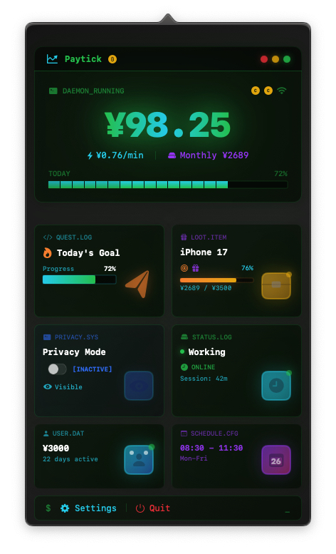
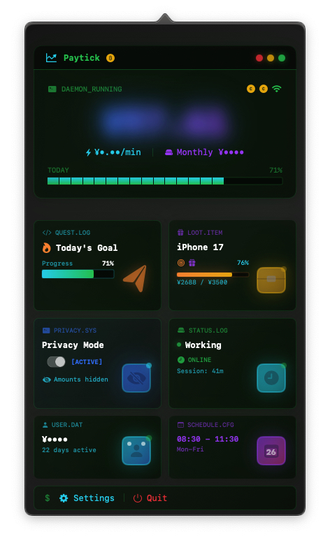
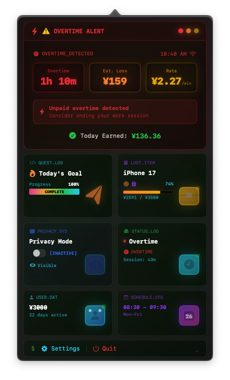

  

<h1 align="center">Paytick</h1>

  <strong>Every second you slack off is another cent toward your next iPhone.</strong>

  <a href="https://github.com/miniLV/Paytick/releases">Download DMG</a> | English | <a href="README.zh-CN.md">简体中文</a>

  
  
  

A real-time income calculator for your macOS menu bar. Enter your salary and work hours, and it shows how much you've earned so far today.

---

## 📸 Screenshots

| Normal State | Privacy Mode | Overtime Alert |
| :---: | :---: | :---: |
|  |  |  |
| *Live earnings* | *Hide the numbers* | *Time to go home* |

---

## ✨ Features

**Live Income Display** — Shows your current earnings in the menu bar, down to the cent. Calculates your per-minute rate.

**Wishlist Tracker** — Want to buy something? Set a target amount and watch the progress bar fill up. iPhone, camera, plane ticket, whatever.

**Overtime Warning** — Working past your scheduled hours? The interface turns red. A reminder that your hourly rate is getting diluted.

**Privacy Mode** — When coworkers lean over:
- Emoji mode: Numbers become 🍎🚀⭐
- Blur mode: Gaussian blur overlay
- Dots mode: Shows ****

---

## 🎨 Visual Style

Cyberpunk terminal aesthetic. Neon green (#00FF00), monospaced fonts, CRT scanlines, occasional glitch effects. Designed in Figma, implemented pixel-perfect.

---

## 🛠 Usage

1. Enter your monthly salary, work days, and schedule
2. App lives in your menu bar
3. Set savings goals (optional)
4. Watch the numbers go up

---

## 🛡 Privacy

All data stays on your Mac. No network calls, no uploads, no tracking. Open source, check for yourself.

Apple notarized. Double-click to run.

---

## 📦 Installation

1. Download `Paytick.dmg` from [Releases](https://github.com/miniLV/Paytick/releases)
2. Drag to Applications
3. Double-click to open. If macOS complains, right-click and select "Open"

---

## 🤝 Contributing

Issues and PRs welcome.

---

## 📄 License

[MIT License](LICENSE)

---

## 💬 A note from the author

Work is just trading time for money. No romance about it. Boss pays, I deliver. Fair deal.

So set yourself a goal. Save up enough, then treat yourself — a nice meal, a new gadget, a trip you've been putting off. Life is hard enough. You need something sweet to keep going.

That's what this tool is for: watch your money add up, know what your time is worth, keep an eye on the clock, and go live your life.

---

  Made with ❤️ by <a href="https://github.com/miniLV">miniLV</a>

