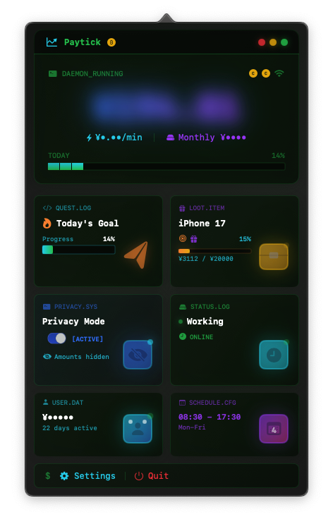

  

<h1 align="center">Paytick — macOS 实时工资计算器</h1>

  <strong>摸鱼的每一秒，都在为下一台 iPhone 攒钱。</strong>

  <a href="https://github.com/miniLV/Paytick/releases">下载 DMG</a> | <a href="README.en.md">English</a> | 简体中文

  
  
  
  
  

一款常驻 macOS 菜单栏的 **实时收入计算器**（工资计算器 / Salary Calculator）。输入月薪和上下班时间，它会实时告诉你当前赚了多少钱 —— 精确到每一分钟。

> 和网页版工资计算器不同，Paytick 是一款 **原生 macOS 应用**，常驻菜单栏，无需打开浏览器，实时显示你的收入流。

---

## 📸 预览

| 正常状态 | 隐私模式 | 加班提醒 |
| :---: | :---: | :---: |
|  |  |  |
| *实时收入跳动* | *一键遮住数字* | *该下班了！* |

---

## 为什么选 Paytick？

| 特性 | 网页版工资计算器 | Paytick |
| :--- | :---: | :---: |
| 实时收入跳动 | 部分支持 | ✅ |
| 菜单栏常驻，无需打开浏览器 | ❌ | ✅ |
| 隐私保护（Emoji / 模糊 / 打码） | ❌ | ✅ |
| 加班提醒 & 时薪稀释警告 | ❌ | ✅ |
| 愿望清单 & 攒钱进度 | ❌ | ✅ |
| 赛博朋克视觉风格 | ❌ | ✅ |
| 数据本地存储，不联网 | 视情况 | ✅ |
| Apple 公证，原生 SwiftUI | ❌ | ✅ |

---

## ✨ 功能

**实时收入显示** — 菜单栏显示当前已赚金额，精确到分。支持按分钟计算收入率。

**愿望清单** — 想买什么东西？设置目标金额，看进度条慢慢填满。iPhone、相机、机票，随你定。

**加班提醒** — 过了下班时间还在干活？界面变红，提醒你时薪正在被稀释。

**隐私保护** — 同事凑过来的时候，一键切换：
- Emoji 模式：数字变成 🍎🚀⭐
- 模糊模式：高斯模糊遮盖
- 打码模式：显示为 ****

---

## 🎨 视觉风格

赛博朋克终端风。霓虹绿主色调 (#00FF00)，等宽字体，CRT 扫描线效果，偶尔来点 Glitch 故障风。

---

## 📦 安装

1. 去 [Releases](https://github.com/miniLV/Paytick/releases) 下载最新版 `Paytick.dmg`
2. 拖进应用程序文件夹
3. 双击打开。如果提示无法验证，右键选"打开"

已通过 Apple 公证，双击即可安全运行。

---

## 🛠 使用方法

1. 输入月薪、工作天数、上下班时间
2. 应用常驻菜单栏，实时显示收入
3. 设置想买的东西，追踪攒钱进度（可选）
4. 看数字跳，享受每一秒的价值

---

## 🛡 隐私

所有数据存在本地。不联网，不上传，不追踪。代码开源，随便看。

---

## 🤝 贡献

欢迎 Issue 和 PR。

如果觉得好用，请给个 ⭐ Star，让更多人看到这个项目！

---

## 📄 许可证

[MIT License](LICENSE)

---

## 💬 写在最后

上班就是拿时间换钱，没什么情怀可言。老板付钱，我出力，公平交易。

所以给自己定个目标吧。攒够多少钱，就奖励自己一顿好吃的、一个新手机、一次说走就走的旅行。日子有点苦，得有点甜头才能走得更远。

这个工具的意义就在这儿：让你看着钱一点点攒起来，了解自己上班的价值，关注下班时间，享受自己的生活吧～

---

## 🔗 相关关键词

macOS 工资计算器 · 实时收入计算器 · 薪资计算器 · 菜单栏收入追踪 · salary calculator macOS · real-time income tracker · menu bar salary app · 上班摸鱼计算器

---

  Made with ❤️ by <a href="https://github.com/miniLV">miniLV</a>

